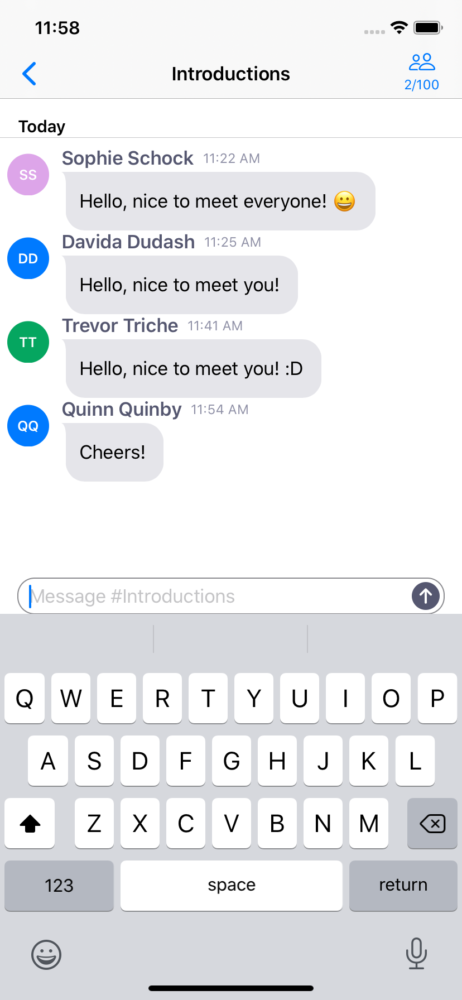
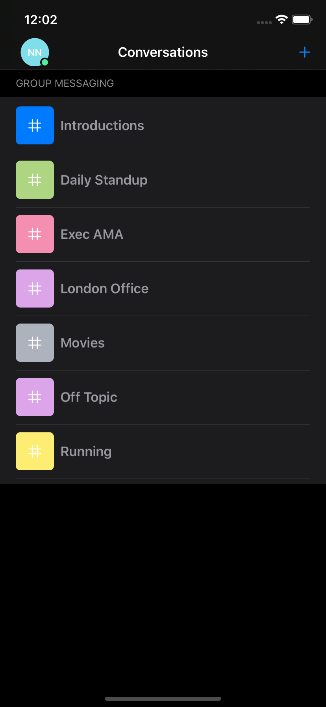

# PubNub Team Chat

Team Chat is our group chat app with features like user login, joining/leaving group conversations, send/receive messages, members online/offline presence, profanity filtering and more. Its UIs are built in SwiftUI, and it uses the [PubNub Client State Management](https://github.com/pubnub/pubnub-swift-csm) framework to manage client state on the application.


 | 
--|---|
 | 

The application demonstrates how to build a chat application using:

- [PubNub Chat](https://www.pubnub.com/products/pubnub-chat/)
- [SwiftUI](https://developer.apple.com/xcode/swiftui/)
- [ReSwift](https://github.com/ReSwift/ReSwift)

## Prerequisites

- [Xcode](https://developer.apple.com/xcode)
- [PubNub Account](#pubnub-account) (*Free*)

## Requirements
- iOS 13.0+ / Mac Catalyst 13.0+ / tvOS 13.0+ / watchOS 6.0+
- Xcode 11.4+
- Swift 5+

## PubNub Account

To run this application you must obtain publish and subscribe keys from your PubNub Account. If you don't already have an account, you can [create one for free](https://dashboard.pubnub.com/).

1. Sign in to your [PubNub Dashboard](https://dashboard.pubnub.com/).

1. Click **Create New App**.

1. Give your app a name, and select **Chat App** as the app type.

1. Select a region to store your user data (e.g. *Portland*).

1. Click **Create**.

1. Click your new app to open its settings, then click its keyset.

1. Locate the *Publish* and *Subscribe* keys. You'll need these keys to include in this project.

## Running the project

1. Clone the GitHub repository.

    ```bash
    git clone git@github.com:pubnub/swift-ref-app-team-chat.git
    ```

1. Set the following environment variables inside your terminal's configuration file (such as `~/.bash_profile`).

    ```bash
    export TEAM_CHAT_PUB_KEY="<Enter Your PubNub Publish Key Here>"
    export TEAM_CHAT_SUB_KEY="<Enter Your PubNub Subscribe Key Here>"
        ```

1. Setup the project.

    ```bash
    cd swift-ref-app-team-chat
    bundle install && brew bundle && npm install
    bundle exec fastlane setup
    ```

1. When `fastlane setup` has completed, run the following command in your Terminal window:

    ```bash
    open TeamChat.xcodeproj
    ```

1. Then, use the `Run` command on the `TeamChat` scheme to build and execute the application on your physical device or simulator.

## Further Information

Visit the [PubNub Chat Docs](https://www.pubnub.com/docs/chat/quickstart) page for more information about how to use SwiftUI and the [PubNub Client State Management](https://github.com/pubnub/pubnub-swift-csm) framework to add in-app chat to your applications.
